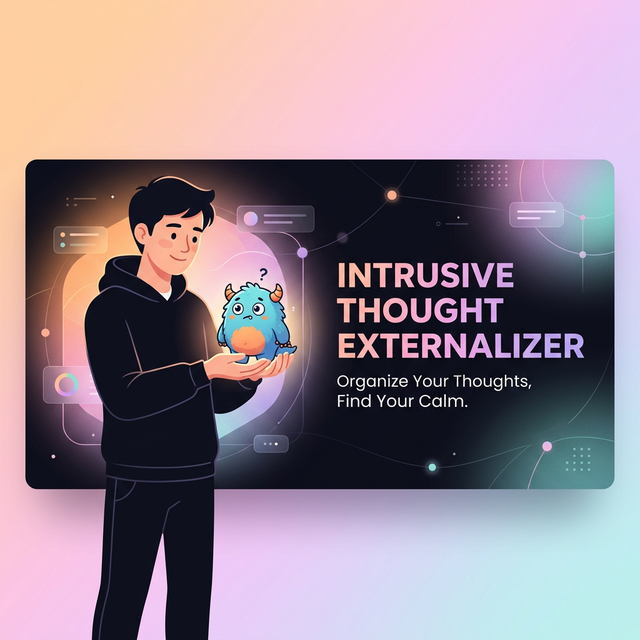
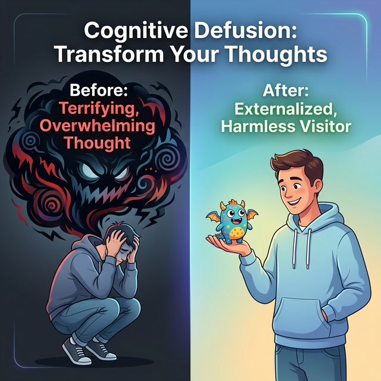
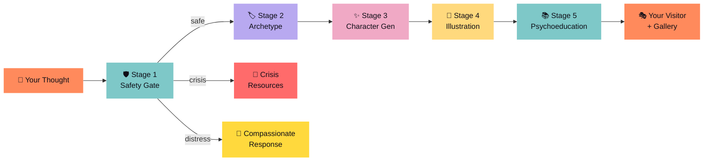
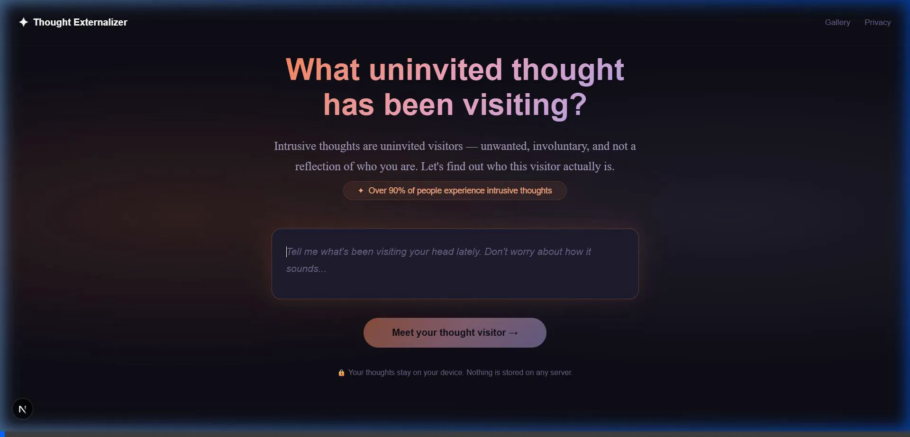
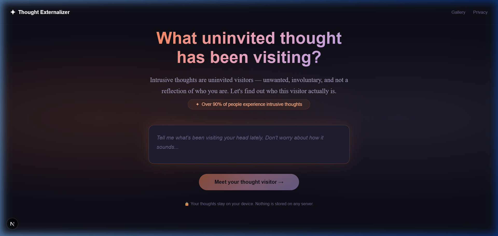
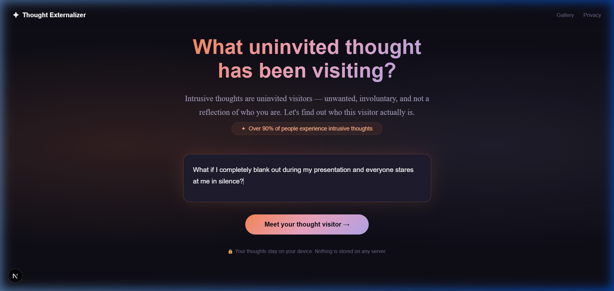
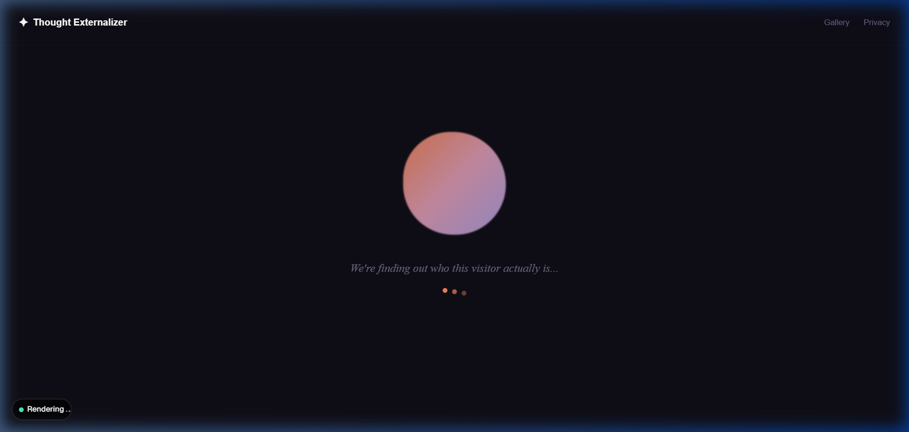
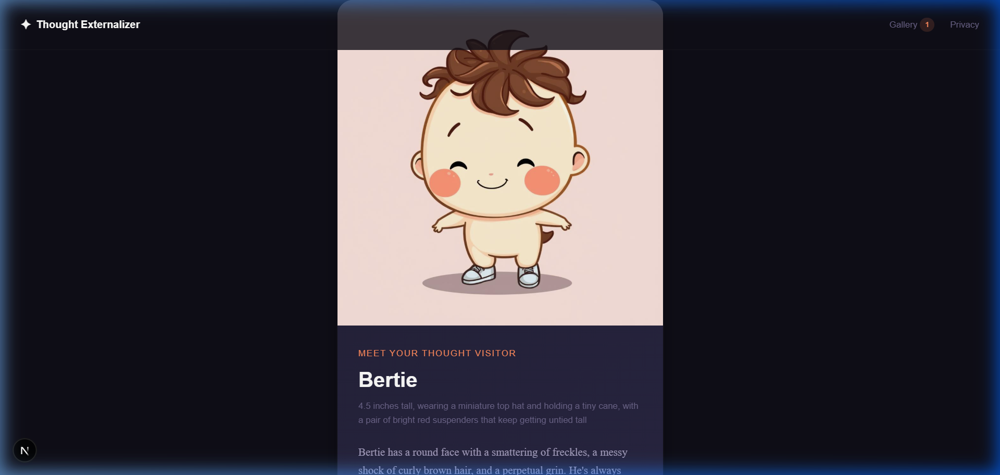
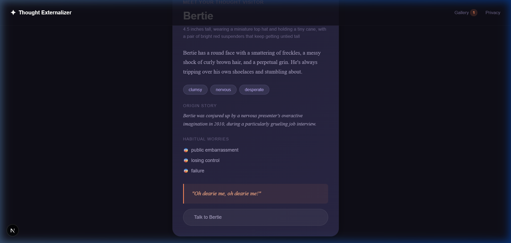
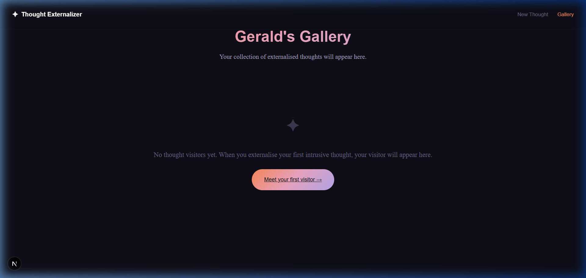

<p align="center">
  
</p>

<p align="center">
  
</p>

<p align="center">
  
  
  
</p>

<p align="center">
  
  
  
  
  
  
  
</p>

<p align="center">
  
  
  
</p>

<br/>

<p align="center">
  <b>⚡ Quick Start:</b>
  <br/>
  <code>git clone https://github.com/GauravS13/intrusive_thought_externalizer.git && cd intrusive_thought_externalizer && npm install && npm run dev</code>
</p>

<br/>

<p align="center"><em>
"What if your scariest thought was actually just a confused, 4-inch tall blob named Gerald who's terrified of toast?"
</em></p>

---

## 🧠 The Science: Why This Exists

> **"You are not your thoughts."** — Steven C. Hayes, founder of ACT

**94% of people** experience intrusive thoughts — unwanted, involuntary mental visitors that feel alien and frightening. The clinical standard for managing them isn't to fight them. It's **cognitive defusion**: the practice of stepping back and observing thoughts as *objects* rather than *truths*.

The **Intrusive Thought Externalizer** automates this therapeutic technique using AI. You describe what's been haunting you, and our 5-stage neural pipeline transforms it into a **harmless, absurd, illustrated cartoon character** — complete with a personality, backstory, worries of its own, and a ridiculous catchphrase.

<p align="center">
  
</p>

It's not a toy. It's a clinically-grounded defusion tool that makes the invisible visible, the terrifying laughable, and the isolating universal.

---

## ⚡ How It Works: The 5-Stage Pipeline



<table>
<tr>
<td width="50%" valign="top">

### 🛡️ Stage 1 — Safety Gate
Every input passes through a **crisis detection classifier** first. If distress or crisis language is detected, the pipeline halts immediately and surfaces validated crisis helpline resources. Character generation never occurs for unsafe inputs.

*Model: `meta-llama/Llama-3.2-3B-Instruct`*

</td>
<td width="50%" valign="top">

### 🏷️ Stage 2 — Archetype Classification
The thought is semantically mapped to one of **8 clinically-grounded archetypes** derived from ACT literature:

`Catastrophiser` · `Contaminator` · `Imposter` · `Intrude` · `Perfectionist` · `Detacher` · `Relationshipist` · `Spiralist`

*Model: `meta-llama/Llama-3.2-3B-Instruct`*

</td>
</tr>
<tr>
<td width="50%" valign="top">

### ✨ Stage 3 — Character Personality
A full character profile is generated: **name**, height (always tiny), physical description, 3 personality traits, origin story, 3 habitual worries, and a signature catchphrase.

Every character is designed to be fundamentally *absurd, harmless, and ineffectual*.

*Model: `meta-llama/Llama-3.2-3B-Instruct`*

</td>
<td width="50%" valign="top">

### 🎨 Stage 4 — Visual Synthesis
A unique illustration is generated for each character using strict positive/negative prompt guardrails. Images are always **soft, pastel, cartoon-style** — never dark, realistic, or threatening.

Falls back to archetype-specific SVG illustrations if the API is unavailable.

*Model: `black-forest-labs/FLUX.1-schnell`*

</td>
</tr>
<tr>
<td colspan="2" align="center">

### 📚 Stage 5 — Psychoeducation
Static, clinically-appropriate templates explain *what just happened*, *why this thought type is normal*, and *what to do when the character visits again*. These are **NOT AI-generated** — they are handwritten to ensure clinical accuracy and safety.

</td>
</tr>
</table>

---

## 🎭 Features

<table>
<tr>
<td align="center" width="33%">
<h4>💬 Talk to Your Thought</h4>
<p>Chat directly with your generated character. They stay perfectly in-persona — confused, bumbling, and hilariously non-threatening.</p>
</td>
<td align="center" width="33%">
<h4>🖼️ Character Gallery</h4>
<p>All thought visitors are saved locally to your personal gallery. Revisit, inspect, and manage your collection of externalized thoughts across sessions.</p>
</td>
<td align="center" width="33%">
<h4>🔒 Zero Server Storage</h4>
<p>Your thoughts never leave your device. All data is stored in browser-local IndexedDB. The server is a stateless AI proxy — no databases, no logs, no cookies.</p>
</td>
</tr>
<tr>
<td align="center" width="33%">
<h4>💛 Crisis Safety Net</h4>
<p>If the AI detects genuine distress or crisis language, the pipeline halts immediately and surfaces 24/7 crisis helpline resources. No character is generated. No data is stored.</p>
</td>
<td align="center" width="33%">
<h4>♿ Accessible by Design</h4>
<p>WCAG 2.1 AA contrast ratios, 44px minimum touch targets, full keyboard navigation, auto-generated alt-text for all character illustrations, and semantic HTML throughout.</p>
</td>
<td align="center" width="33%">
<h4>🌙 Premium Dark UI</h4>
<p>Warm gradients, glassmorphism cards, micro-animations (breathe, pulse-morph, slide-up), and Outfit typography. Designed to feel like a safe, cozy space — never clinical.</p>
</td>
</tr>
</table>

---

## 🎬 Demo Video

> Watch the complete 5-stage AI defusion pipeline in action — turning a fearful intrusive thought into a whimsical cartoon character in real-time.

<p align="center">
  <a href="https://drive.google.com/file/d/1GquBmJWLFv2pp3Fn0XKM8J9gdJkBLWg8/view?usp=sharing">
    
  </a>
</p>

<p align="center">
  <a href="https://drive.google.com/file/d/1GquBmJWLFv2pp3Fn0XKM8J9gdJkBLWg8/view?usp=sharing">
    
  </a>
</p>

<details>
<summary>💡 <strong>Can't see the video above?</strong> Click here for direct playback</summary>
<br/>

<p align="center">
  <video src="./demo/intrusive_thought_externalizer.mp4" width="100%" controls>
    Your browser does not support the video tag. <a href="https://drive.google.com/file/d/1GquBmJWLFv2pp3Fn0XKM8J9gdJkBLWg8/view?usp=sharing">Watch on Google Drive instead →</a>
  </video>
</p>

</details>

---

## 📸 Demo Screenshots

> A step-by-step walkthrough of the full externalization experience.

<table>
<tr>
<td align="center" width="50%">
<strong>1. Safe Space — Input Screen</strong><br/><br/>

</td>
<td align="center" width="50%">
<strong>2. Thought Entered</strong><br/><br/>

</td>
</tr>
<tr>
<td align="center" width="50%">
<strong>3. AI Processing Animation</strong><br/><br/>

</td>
<td align="center" width="50%">
<strong>4. Meet Your Thought Visitor</strong><br/><br/>

</td>
</tr>
<tr>
<td align="center" width="50%">
<strong>5. Character Details + Chat</strong><br/><br/>

</td>
<td align="center" width="50%">
<strong>6. Character Gallery</strong><br/><br/>

</td>
</tr>
</table>

---

## 🏗️ Architecture

```
intrusive-thought-externalizer/
│
├── src/
│   ├── app/
│   │   ├── page.tsx              # Main flow: Input → Loading → Character Reveal
│   │   ├── gallery/page.tsx      # Character gallery with modal detail view
│   │   ├── privacy/page.tsx      # Plain-language privacy policy
│   │   ├── layout.tsx            # Root layout with Outfit font + SEO
│   │   ├── globals.css           # Full design system (300+ lines of vanilla CSS)
│   │   └── actions/
│   │       ├── process-thought.ts  # 5-stage pipeline orchestrator (Server Action)
│   │       └── chat-action.ts      # In-persona dialogue (Server Action)
│   │
│   ├── lib/ai/
│   │   ├── hf-client.ts          # HuggingFace API client (retry, timeout, cold-start)
│   │   ├── safety-classifier.ts  # Stage 1: Crisis detection
│   │   ├── thought-classifier.ts # Stage 2: Archetype mapping
│   │   ├── character-generator.ts# Stage 3: Personality generation + fallback library
│   │   ├── image-generator.ts    # Stage 4: FLUX.1 image gen + SVG fallbacks
│   │   ├── caption-generator.ts  # Stage 4b: Alt-text from profile data
│   │   ├── psychoeducation.ts    # Stage 5: Static clinical templates
│   │   └── types.ts              # TypeScript interfaces
│   │
│   ├── lib/storage/
│   │   └── character-db.ts       # IndexedDB CRUD (all data stays client-side)
│   │
│   ├── hooks/
│   │   └── useCharacterGallery.ts# React hook for gallery state management
│   │
│   └── components/
│       └── DialogueInterface.tsx  # "Talk to your thought" chat UI
│
└── .env.local                     # HF_TOKEN (never committed)
```

---

## 🚀 Getting Started

### Prerequisites

- **Node.js** ≥ 18.18
- **npm** ≥ 9
- A free [HuggingFace API Token](https://huggingface.co/settings/tokens)

### 1. Clone the Repository

```bash
git clone https://github.com/GauravS13/intrusive_thought_externalizer.git
cd intrusive_thought_externalizer
```

### 2. Install Dependencies

```bash
npm install
```

### 3. Configure Environment

Create a `.env.local` file in the project root:

```env
HF_TOKEN=hf_your_token_here
```

> 💡 Get your free token at [huggingface.co/settings/tokens](https://huggingface.co/settings/tokens). All models used are available on the free tier.

### 4. Start Development Server

```bash
npm run dev
```

Open [http://localhost:3000](http://localhost:3000) and externalize your first thought.

---

## 💻 Tech Stack

| Layer | Technology | Why |
|-------|-----------|-----|
| **Framework** | Next.js 16 (App Router) | Server Actions as AI proxy, Turbopack for instant HMR |
| **Language** | TypeScript | End-to-end type safety across pipeline |
| **Styling** | Vanilla CSS | Full control over design system, no utility-class bloat |
| **AI — Text** | Llama 3.2 3B Instruct | Fast, free-tier, OpenAI-compatible chat API |
| **AI — Image** | FLUX.1-schnell | Rapid, high-quality image generation |
| **AI — API** | HuggingFace Inference | `router.huggingface.co` with retry + cold-start handling |
| **Storage** | IndexedDB (`idb`) | Client-only persistence, zero server databases |
| **Typography** | Google Fonts (Outfit + Crimson Text) | Display + serif pairing for warmth |

---

## 🛡️ Ethical Design Decisions

This project was built with the MINDCODE 2026 [Ethical Guidelines](https://mindcode-hackathon.pages.dev/) at its core:

| Principle | Implementation |
|-----------|---------------|
| **Privacy First** | Zero server storage. All data in browser IndexedDB. No cookies, no analytics, no tracking. |
| **Do No Harm** | Safety classifier runs *before* any creative generation. Crisis resources are always available. |
| **Inclusive Design** | WCAG 2.1 AA contrast, 44px touch targets, keyboard navigation, screen-reader alt-text. |
| **Transparency** | AI-generated content is clearly labeled. Psychoeducation is static (not AI-generated) to ensure clinical accuracy. |
| **Sustainable Impact** | Clean architecture, comprehensive documentation, MIT license for community building. |

---

## 🧬 The 8 Archetypes

<table>
<tr>
<td align="center">😱<br/><b>Catastrophiser</b><br/><em>"What if everything goes wrong?"</em></td>
<td align="center">🦠<br/><b>Contaminator</b><br/><em>"What if it's not clean enough?"</em></td>
<td align="center">🎭<br/><b>Imposter</b><br/><em>"What if they find out I'm a fraud?"</em></td>
<td align="center">⚡<br/><b>Intrude</b><br/><em>"Why did I just think that?"</em></td>
</tr>
<tr>
<td align="center">📐<br/><b>Perfectionist</b><br/><em>"It's not good enough yet."</em></td>
<td align="center">🌫️<br/><b>Detacher</b><br/><em>"Nothing feels real right now."</em></td>
<td align="center">💔<br/><b>Relationshipist</b><br/><em>"What if they leave me?"</em></td>
<td align="center">🌀<br/><b>Spiralist</b><br/><em>"Everything is connected and getting worse."</em></td>
</tr>
</table>

Each archetype has a complete fallback character library, ensuring the app works even when the AI is cold-starting.

---

## 📜 License

This project is open source under the [MIT License](LICENSE).

---

<p align="center">
  
</p>

<p align="center">
  Built with 💛 for <a href="https://hackformental.com/2026">MINDCODE 2026</a> — 72 hours to build tools that matter.
</p>
